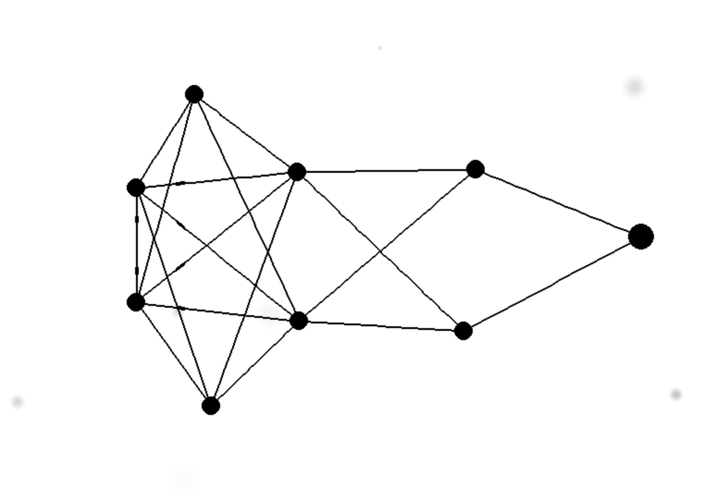

# Spiking Neural Network Simulation
### A visual simulation tool designed for the exploration and analysis of spiking neural networks (SNNs).

Users can create custom networks of neurons and connections, enabling experimentation with various training methods and topologies. The tool provides real-time visualization of neural spiking activity. 

Note: Future updates will likely include methods for immediate observation of parameter adjustments, customization of neuron and synapse properties, basic learning algorithms.

Key features include neuron and connection creation with an intuitive interface for network construction and modification. This tool serves as a practical resource for neural network, machine learning, and AI enthusiasts, promoting active engagement and deeper understanding of SNNs and Liquid Neural Networks.

## Features
- Neuron creation and connection
- Simulation of neuron firing and signal propagation
- Visual representation of neurons and their connections

## Installation
1. Clone this repository
2. Install required packages: `pip install -r requirements.txt`
3. Run the main script: `python main.py`

## Usage
1. Add Neurons: Left-click to add neurons to the simulation.
2. Remove Neurons: Right-click a neuron to remove it.
3. Connect Neurons: Left-click and drag from one neuron to another to create a connection.
4. Stimulate Neurons: Hover over a neuron with the mouse to stimulate it.

## Contributing
Currently, this project is not open for contributions. We may consider accepting contributions in the future.

## License
This project is not licensed for use, modification, or distribution at this time. Licensing information may be updated in the future.

## Contact
For any inquiries or questions, please contact me through github.